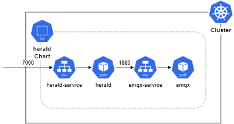

# herald
`herald` means messanger.  
It is a sample app to introduce pub/sub using message broker(`emqx`).  

`k8s-resources/profiles/local.yaml`:  

  

<br/>

## Installation  
### Download `elio`  
```shell
$ git clone https://github.com/cppis/elio
$ cd elio
```

> Now, **$PWD** is the root path.  

<br/>

### [Setting `Skaffold` on Windows](docs/setting.skaffold.md)  
`Skaffold` settings on windows for continuous developing a Kubernetes-native app.  

<br/><br/><br/>

## Run herald  
### using `Skaffold`  
To use the `Skaffold`, you need thd following the [Setup `Skaffold`](#setup-skaffold).  
First move to Project root directory.  
```shell
$ cd {Project Root}
```

To run `herald` using `Skaffold`, run the following command:  
```shell
$ skaffold -f app\herald\k8s-resources\skaffold.yaml dev -p local
```

Or, to run `herald` in debugging mode using `Skaffold`, run the following command:  
```shell
$ skaffold -f app\herald\k8s-resources\skaffold.yaml debug -p debug
```

<br/><br/><br/>

## Test  
You can test echo easily by using telnet.  
And, you can end server by send `q` character.  

<br/><br/><br/>

## Reference  
* [Building K8S cluster of EMQ X starting from scratch](https://www.emqx.com/en/blog/emqx-mqtt-broker-k8s-cluster)  


<br/><br/><br/>

## TO-DO  
* Run `emqx` as stateful cluster in kubernetes  

<br/><br/><br/>

## Commands  
```shell
$ kubectl describe all -n herald
$ kubectl apply -f app/herald/k8s-resources/profiles/exclude.yaml
$ kubectl delete -f app/herald/k8s-resources/profiles/exclude.yaml
$ kubectl get pv -n herald
$ kubectl get pvc -n herald
$ kubectl delete pv {PVC} -n herald
$ kubectl delete pvc {PVC} -n herald
```

