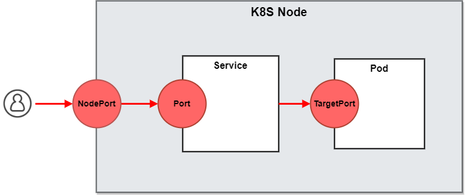

# Setting Service Ports  

## Kubernetes Ports  
There are 3 port settings in the Kubernetes service.  

  

<br/>

### *nodePort(Node)*  
This setting makes the service visible outside the Kubernetes cluster by the node’s IP address and the port number declared in this property. The service also has to be of type NodePort (if this field isn’t specified, Kubernetes will allocate a node port automatically).  

<br/>

### *port(Service)*  
Expose the service on the specified port internally within the cluster. That is, the service becomes visible on this port, and will send requests made to this port to the pods selected by the service.  

<br/>

### *targetPort(Pod)*    
This is the port on the pod that the request gets sent to. Your application needs to be listening for network requests on this port for the service to work.  

<br/><br/><br/>

## Kind  
### [Extra Port Mapping](https://kind.sigs.k8s.io/docs/user/configuration/#extra-port-mappings)  
Extra port mappings can be used to port forward to the kind nodes.  

* [NodePort with Port Mappings](https://kind.sigs.k8s.io/docs/user/configuration/#nodeport-with-port-mappings)  
  To use port mappings with `NodePort`, the kind node `containerPort` and the service `nodePort` needs to be equal.  
  ```yaml
  kind: Cluster
  apiVersion: kind.x-k8s.io/v1alpha4
  nodes:
  - role: control-plane
    extraPortMappings:
    - containerPort: 30950
      hostPort: 80
  ```

<br/><br/><br/>

## Skaffold  
### [Port Forwarding](https://skaffold.dev/docs/pipeline-stages/port-forwarding/)  

### [User-Defined Port Forwarding](https://skaffold.dev/docs/pipeline-stages/port-forwarding/#UDPF)  
Users can define additional resources to port forward in the skaffold config, to enable port forwarding for

* additional resource types supported by `kubectl port-forward` e.g.`Deployment` or `ReplicaSet`.
* additional pods running containers which run images not built by Skaffold.  

  ```yaml
  portForward:
  - resourceType: deployment
    resourceName: myDep
    namespace: mynamespace
    port: 8080
    localPort: 9000 # *Optional*
  ```

  * port: Port is the resource port that will be forwarded.  
  * localPort: LocalPort is the local port to forward too.  